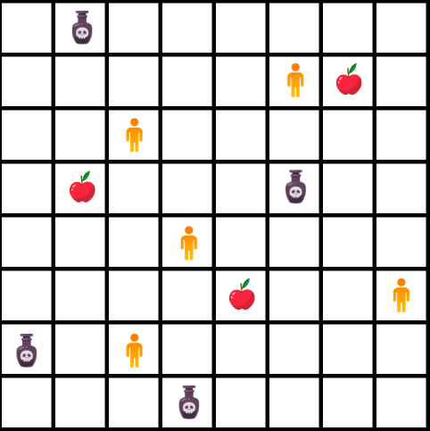

# Genetic Algorith - Survival Game

<p align="center">
  
</p>

## Overview
The goal of this project is designing a *genetic algorithm* to develop survival instinct in a population of individuals.

An individual is defined by a genome and an energy parameter: the genes are related to the possible moves in the environment,
whereas the energy indicates if an individual is still alive $(E > 0)$. Energy is consumed at every step, but
individuals can restore part of it by finding *food* on the grid. It's also possible finding *poison* in the environment, which will
further reduce individual's energy.

The algorithm runs for a given number of generations and every generation has the following pattern:
a fixed number of individuals moves on the simulation environment, a $\text{2D grid}$ (Euclidean lattice),
for a selected number of steps, changing its energy through the aforementioned rules. After that,
the population update is performed: all the inividuals are replaced with new offsprings, generated by
crossing the fitter individuals and applying the mutations.
The simulation runs as long as two individuals are alive or the maximum number of generations is reached.

## Usage
The main program, included in file ```main.py```, requires some non-standard modules:
- Numpy $(\ge 1.21)$
- Matplotlib[^1] $(\ge 3.5)$
- Tabulate $(\ge 0.9)$

[^1]: Only for animation and analysis part (notebooks)

The code is ready to be executed by simply calling ```python main.py``` and adding all required parameters for the simulation.
Here, there's a comprehensive list of required and optional input parameters:
```
positional arguments:
  dimension             Grid dimension
  n_individuals         Population size
  moves                 Steps per generation

optional arguments:
  -h, --help            show this help message and exit
  --genes GENES         Genome length
  --max_generations MAX_GENERATIONS
                        Maximum number of generations
  --energy ENERGY       Initial energy
  --food FOOD           Food fraction
  --poison POISON       Poison fraction
  --p_mutation P_MUTATION
                        Probability of a mutation
  --randseed RANDSEED   Random seed
```

This problem also has a simplified version in which the environment contains only food (no poison). The source code for this version
can be found in *src/simplified_version* and accepts the same list of parameters, except the optional ```--poison```.

In this repository you can also find two *Jupyter Notebooks* to examine the problem and the genetic algorithm from a graphical point of view:\
the file **analysis** contains an investigation of the results for a set of 10 different simulations, whereas **animation** includes the code
to show the movement of the individuals on the grid (and eventually save it).


## Contribution
Feel free to fork this project and test your own configuration. You can also pinpoint errata or possible extensions for the problem.\
Feedbacks are welcome!


